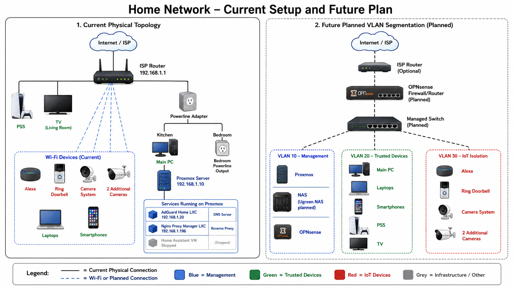

# 🏠 Home Security Lab

A personal homelab built on Proxmox VE, designed to develop practical 
cybersecurity skills in network monitoring, intrusion detection, and 
defensive security operations.

> **Status:** 🔨 Active development — updated regularly

---

## 🎯 Goals

- Build hands-on experience with SOC tools and workflows
- Recreate and improve on my MSc final project in a realistic environment
- Learn network segmentation, traffic analysis, and threat detection
- Document everything as a learning resource

---

## 🏗️ Architecture

| Service | Type | IP | Purpose |
|---------|------|----|---------|
| Proxmox VE 9.0 | Hypervisor | 192.168.1.10 | Host for all VMs and containers |
| AdGuard Home | LXC Container | 192.168.1.20 | DNS server, ad blocking, local DNS rewrites |
| Nginx Proxy Manager | LXC Container | 192.168.1.196 | Reverse proxy for local domain access |
| Home Assistant | VM (stopped) | - | Future: smart home integration |

### Network Diagram


### Planned additions
- [ ] OPNsense (dedicated machine) — router + firewall
- [ ] Suricata — inline IPS inside OPNsense
- [ ] Zeek — network traffic analysis
- [ ] Wazuh — SIEM and log aggregation
- [ ] Nextcloud — self-hosted family cloud storage
- [ ] Ugreen NAS — network attached storage

---

## 🔧 Setup Notes

### Finding a forgotten Proxmox IP
When I lost track of the Proxmox server address, I used nmap to scan 
the network and identify it by its vendor MAC address:

```bash
nmap -p 8006 192.168.1.0/24
```

Proxmox devices have MAC addresses registered to 
**Proxmox Server Solutions GmbH (BC:24:11:xx:xx:xx)**, 
which allowed me to identify the correct host among 15 active devices.
This is a practical example of network reconnaissance used defensively.

### Local DNS with AdGuard
Custom `.ya` domain rewrites configured in AdGuard Home:

| Domain | Resolves to |
|--------|------------|
| proxmox.ya | 192.168.1.10 |
| adguard.ya | 192.168.1.20 |
| nginx.ya | 192.168.1.196 |

### Reverse Proxy with Nginx Proxy Manager
Nginx Proxy Manager allows access to all services via clean domain 
names without port numbers. Installed as an LXC container using the 
community scripts project.

---

## 📚 Related Projects

- [Snort Hydra Detection](https://github.com/YuriAvello/SnortHydraDetection) 
  — MSc final project: detecting slow-rate SSH brute force with Snort IDS.
  To be rebuilt in this homelab with Suricata, Zeek, and Wazuh for a 
  more realistic and layered detection approach.

---

## 🛠️ Tools & Technologies


---

## 📖 Learning Resources

- [TryHackMe SOC Level 1](https://tryhackme.com/path/outline/soclevel1)
- [LetsDefend SOC Analyst Path](https://app.letsdefend.io/path/soc-analyst-learning-path)
- [HackTheBox CDSA](https://academy.hackthebox.com/preview/certifications/htb-certified-defensive-security-analyst)
- [Community Proxmox Scripts](https://community-scripts.github.io/ProxmoxVE)

---

## 📬 Connect

[](https://www.linkedin.com/in/yuriavello/)
[](https://github.com/YuriAvello)
